02_MHO
================
2025-09-09

``` r
library(pROC)
```

    ## Type 'citation("pROC")' for a citation.

    ## 
    ## Adjuntando el paquete: 'pROC'

    ## The following objects are masked from 'package:stats':
    ## 
    ##     cov, smooth, var

``` r
load('data_rmd.RData')

for (station in estaciones){
  mho <- get(paste0('mho.', station))
  X <- get(paste0('X.', station))
  
  summary(mho)
  
  boxplot(mho$fitted.values ~ X$Y,
          xlab = 'Y real',
          ylab = 'P(Y = 1| X)',
          main = station)
  
  pred <- predict(mho, type = 'response')
  roc <- roc(X$Y, pred)
  plot(roc, col="blue", main = paste('Curva ROC', station), 
       print.thres = T,
       print.auc = T)
    
  thres <- coords(roc, 'best')[1]
  
  pred_class <- ifelse(pred > thres, 1, 0)
  table <- table(Predicho = cut(pred,c(0,thres,1)), Real = X$Y)
  
  print(table)
  
  print(round(100*prop.table(table, 2)), 2)
  
  rm(list = c('X', 'mho', 'pred', 'rho', 'station', 'thres', 'pred_class', 'table'))
}
```

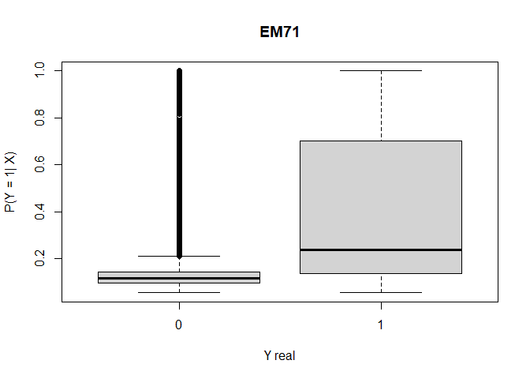<!-- -->

    ## Setting levels: control = 0, case = 1

    ## Setting direction: controls < cases

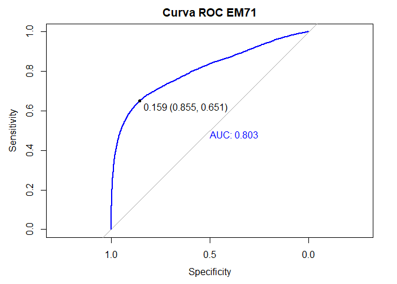<!-- -->

    ##            Real
    ## Predicho        0     1
    ##   (0,0.159] 28461  2657
    ##   (0.159,1]  4822  4947
    ##            Real
    ## Predicho     0  1
    ##   (0,0.159] 86 35
    ##   (0.159,1] 14 65

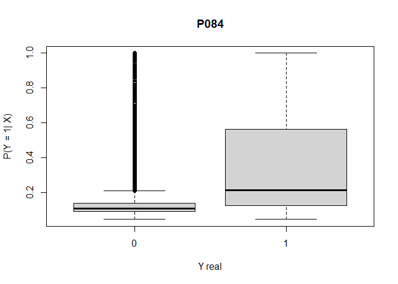<!-- -->

    ## Setting levels: control = 0, case = 1
    ## Setting direction: controls < cases

<!-- -->

    ##            Real
    ## Predicho        0     1
    ##   (0,0.159] 30241  2777
    ##   (0.159,1]  4984  4465
    ##            Real
    ## Predicho     0  1
    ##   (0,0.159] 86 38
    ##   (0.159,1] 14 62

<!-- -->

    ## Setting levels: control = 0, case = 1
    ## Setting direction: controls < cases

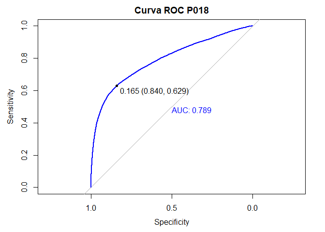<!-- -->

    ##            Real
    ## Predicho        0     1
    ##   (0,0.165] 47774  4514
    ##   (0.165,1]  9107  7661
    ##            Real
    ## Predicho     0  1
    ##   (0,0.165] 84 37
    ##   (0.165,1] 16 63

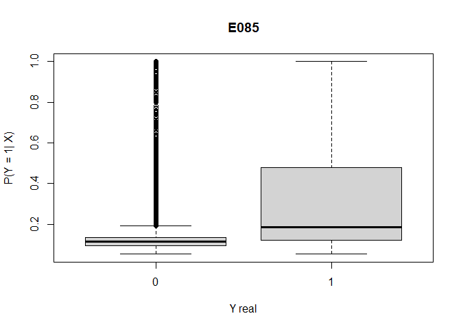<!-- -->

    ## Setting levels: control = 0, case = 1
    ## Setting direction: controls < cases

<!-- -->

    ##            Real
    ## Predicho        0     1
    ##   (0,0.149] 24949  2238
    ##   (0.149,1]  4180  3360
    ##            Real
    ## Predicho     0  1
    ##   (0,0.149] 86 40
    ##   (0.149,1] 14 60

<!-- -->

    ## Setting levels: control = 0, case = 1
    ## Setting direction: controls < cases

<!-- -->

    ##            Real
    ## Predicho        0     1
    ##   (0,0.163] 32059  2919
    ##   (0.163,1]  4702  4368
    ##            Real
    ## Predicho     0  1
    ##   (0,0.163] 87 40
    ##   (0.163,1] 13 60

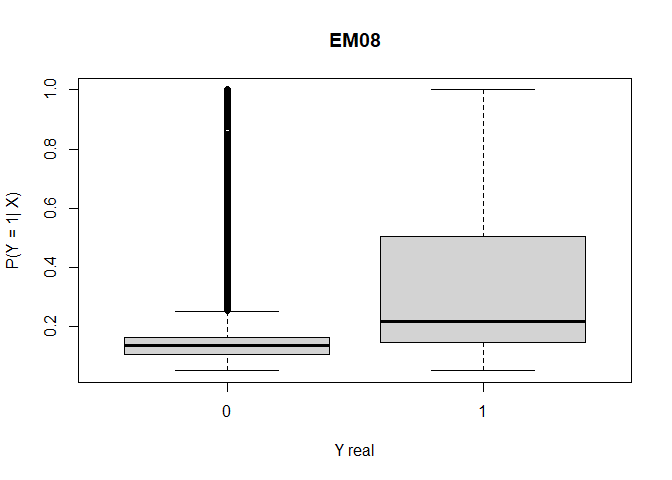<!-- -->

    ## Setting levels: control = 0, case = 1
    ## Setting direction: controls < cases

<!-- -->

    ##            Real
    ## Predicho        0     1
    ##   (0,0.187] 29665  3319
    ##   (0.187,1]  4803  4707
    ##            Real
    ## Predicho     0  1
    ##   (0,0.187] 86 41
    ##   (0.187,1] 14 59

<!-- -->

    ## Setting levels: control = 0, case = 1
    ## Setting direction: controls < cases

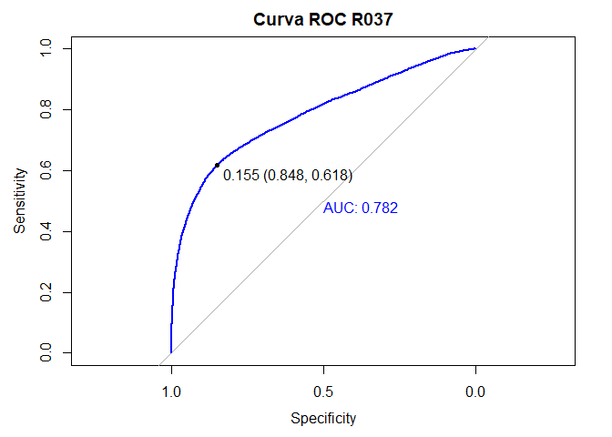<!-- -->

    ##            Real
    ## Predicho        0     1
    ##   (0,0.155] 30751  2717
    ##   (0.155,1]  5501  4387
    ##            Real
    ## Predicho     0  1
    ##   (0,0.155] 85 38
    ##   (0.155,1] 15 62

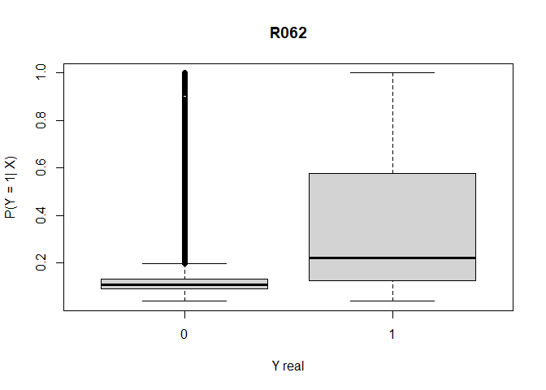<!-- -->

    ## Setting levels: control = 0, case = 1
    ## Setting direction: controls < cases

<!-- -->

    ##            Real
    ## Predicho        0     1
    ##   (0,0.151] 34633  2924
    ##   (0.151,1]  6036  5313
    ##            Real
    ## Predicho     0  1
    ##   (0,0.151] 85 35
    ##   (0.151,1] 15 65

<!-- -->

    ## Setting levels: control = 0, case = 1
    ## Setting direction: controls < cases

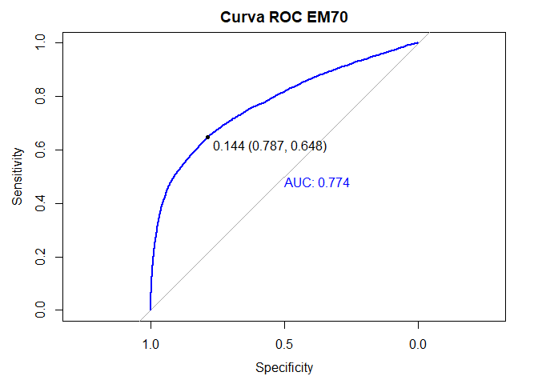<!-- -->

    ##            Real
    ## Predicho        0     1
    ##   (0,0.144] 29851  2583
    ##   (0.144,1]  8099  4755
    ##            Real
    ## Predicho     0  1
    ##   (0,0.144] 79 35
    ##   (0.144,1] 21 65

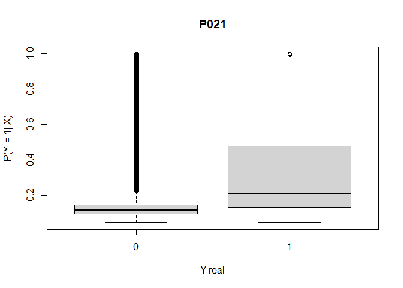<!-- -->

    ## Setting levels: control = 0, case = 1
    ## Setting direction: controls < cases

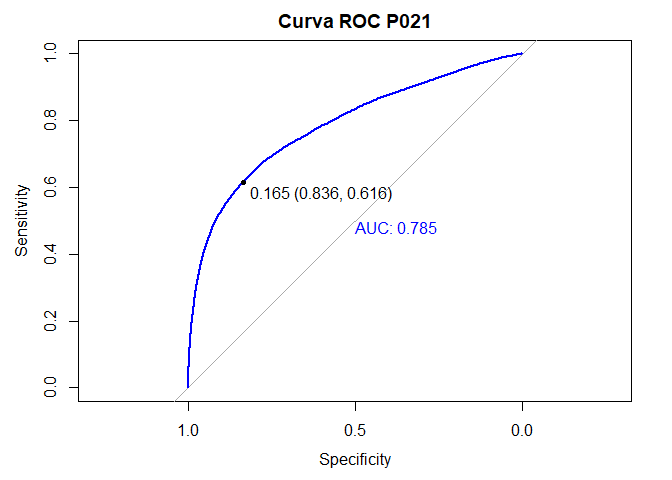<!-- -->

    ##            Real
    ## Predicho        0     1
    ##   (0,0.165] 45956  4385
    ##   (0.165,1]  9035  7032
    ##            Real
    ## Predicho     0  1
    ##   (0,0.165] 84 38
    ##   (0.165,1] 16 62

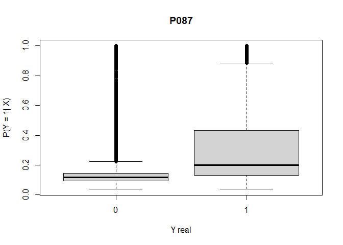<!-- -->

    ## Setting levels: control = 0, case = 1
    ## Setting direction: controls < cases

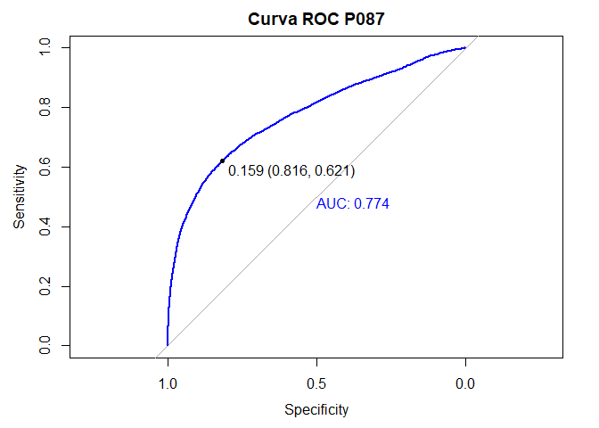<!-- -->

    ##            Real
    ## Predicho        0     1
    ##   (0,0.159] 28367  2642
    ##   (0.159,1]  6403  4332
    ##            Real
    ## Predicho     0  1
    ##   (0,0.159] 82 38
    ##   (0.159,1] 18 62

<!-- -->

    ## Setting levels: control = 0, case = 1
    ## Setting direction: controls < cases

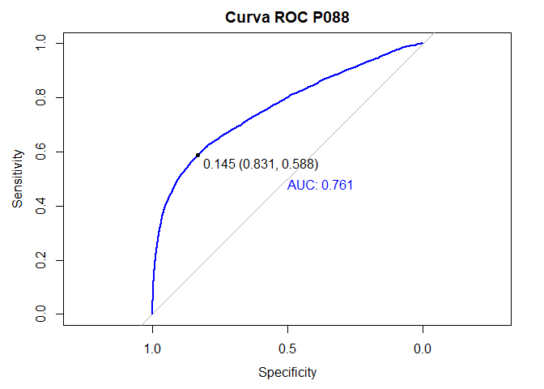<!-- -->

    ##            Real
    ## Predicho        0     1
    ##   (0,0.145] 27760  2409
    ##   (0.145,1]  5636  3442
    ##            Real
    ## Predicho     0  1
    ##   (0,0.145] 83 41
    ##   (0.145,1] 17 59

<!-- -->

    ## Setting levels: control = 0, case = 1
    ## Setting direction: controls < cases

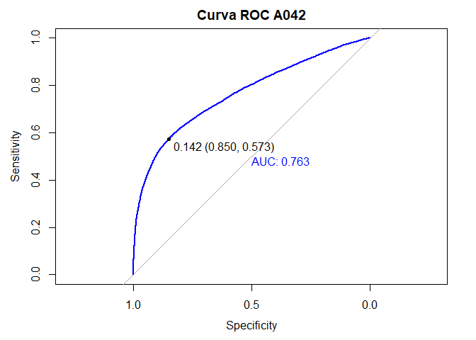<!-- -->

    ##            Real
    ## Predicho        0     1
    ##   (0,0.142] 46188  3918
    ##   (0.142,1]  8136  5247
    ##            Real
    ## Predicho     0  1
    ##   (0,0.142] 85 43
    ##   (0.142,1] 15 57

<!-- -->

    ## Setting levels: control = 0, case = 1
    ## Setting direction: controls < cases

<!-- -->

    ##            Real
    ## Predicho        0     1
    ##   (0,0.154] 40747  3579
    ##   (0.154,1]  8323  5883
    ##            Real
    ## Predicho     0  1
    ##   (0,0.154] 83 38
    ##   (0.154,1] 17 62

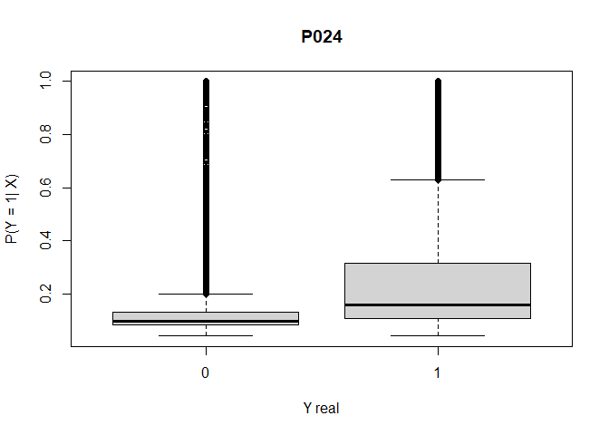<!-- -->

    ## Setting levels: control = 0, case = 1
    ## Setting direction: controls < cases

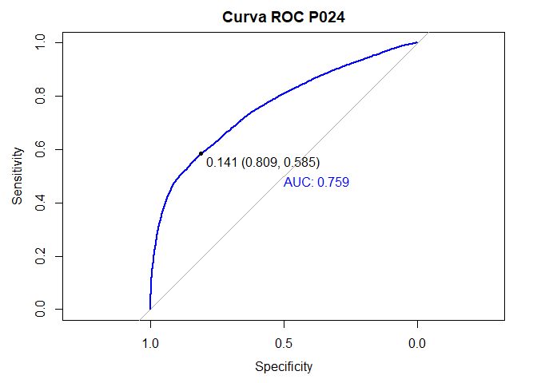<!-- -->

    ##            Real
    ## Predicho        0     1
    ##   (0,0.141] 33202  2733
    ##   (0.141,1]  7820  3850
    ##            Real
    ## Predicho     0  1
    ##   (0,0.141] 81 42
    ##   (0.141,1] 19 58

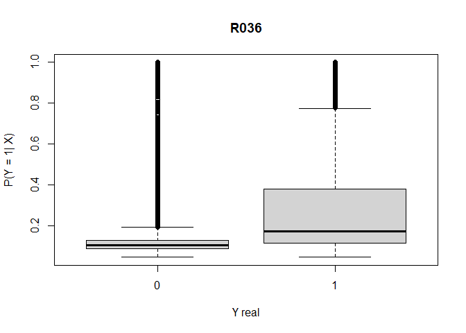<!-- -->

    ## Setting levels: control = 0, case = 1
    ## Setting direction: controls < cases

<!-- -->

    ##            Real
    ## Predicho        0     1
    ##   (0,0.139] 33209  2744
    ##   (0.139,1]  7661  4339
    ##            Real
    ## Predicho     0  1
    ##   (0,0.139] 81 39
    ##   (0.139,1] 19 61
